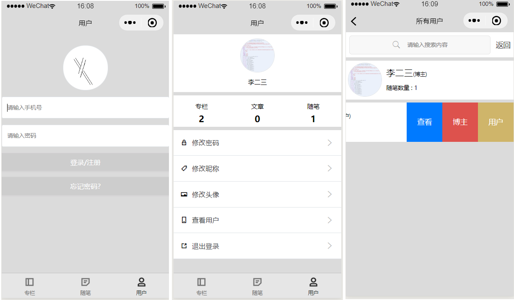
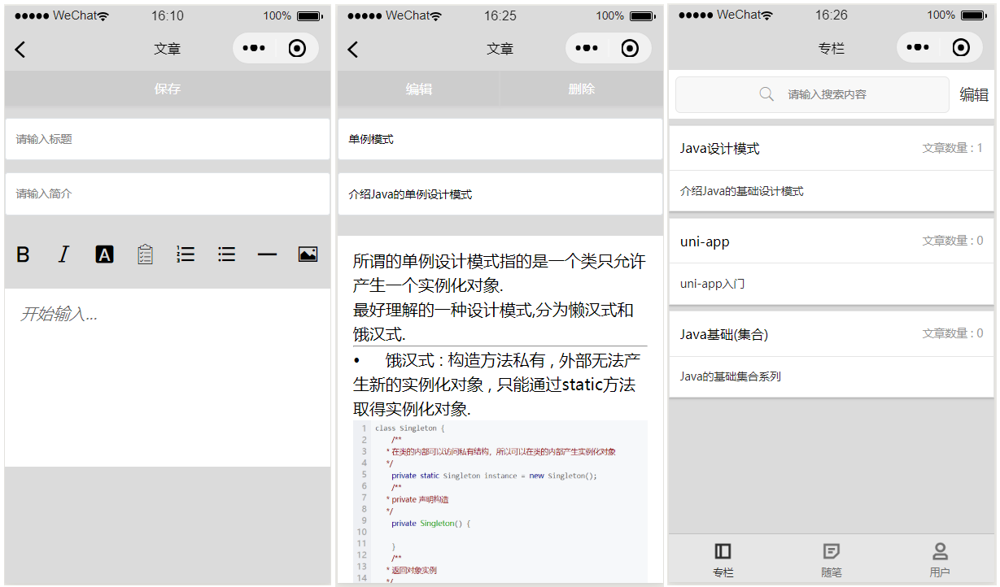

# BambooPaper

### 介绍
简单的微信小程序博客,采用前后端分离模式,接口遵循Restful风格,采用uni-app+SpringBoot+uni-ui框架,如果想入门进行学习SpringBoot或者uni-app,我想这个项目应该是一个不错的选择.


### 软件架构
#### 前端技术栈

1. uni-app
2. uni-ui
3. Vuex

#### 后端技术栈

1. SpringBoot
2. Mybatis
3. 通用Mapper
4. Swagger
5. Mysql
6. Restful风格 


### 开发环境

2.  Java : Intellij IDEA 2019.1
3.  前端 : HBuilder X 2.6.1
3.  数据库 : Mysql 5.7.27
4.  JDK : JDK8
5.  微信小程序IDE : WeChat 1.0.2.1911180


### 使用说明

1.  前端将bp_wx导入HBuilder中运行到微信小程序即可
2.  后端将bp_java中的bp导入项目到idea,maven项目,运行BpApplication即可
3.   http://localhost:8080/doc.html  查看接口文档 
4.  后端使用时在utils/utils中有OSSUtils中的阿里云配置信息修改成自己的阿里云配置信息
5.  前端项目根目录下manifest.json中微信小程序配置中的AppID修改成自己的
6.  将sql中的文件导入进MySQL数据库


### 项目展示






### 前端目录结构

```
bp_wx			(项目主目录)
|-common		公共样式或者js文件
|-components	本项目使用的组件
|-pages			应用页面
|-static		存放图片等静态文件
|-store			存放Vuex文件
|-unpackage		编译后目录
```


### 后端目录结构

```
bp				(项目主目录)
|-config		项目配置类
|-controller	Controller层
|-service		业务层
|-mapper		持久层
|-dto			dto实体类
|-entity		实体类
|-utils			工具
	|-entity	封装通用返回类
	|-exception	全局异常拦截
	|-mapper	通用mapper接口
	|-utils		通用工具类
```

